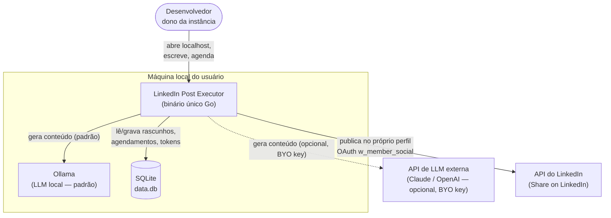
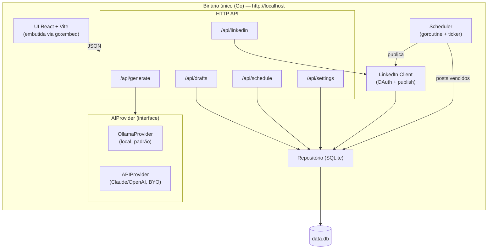
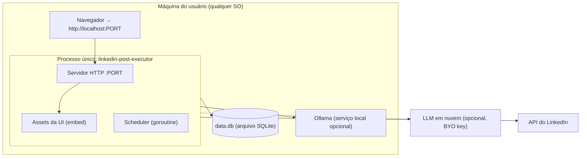
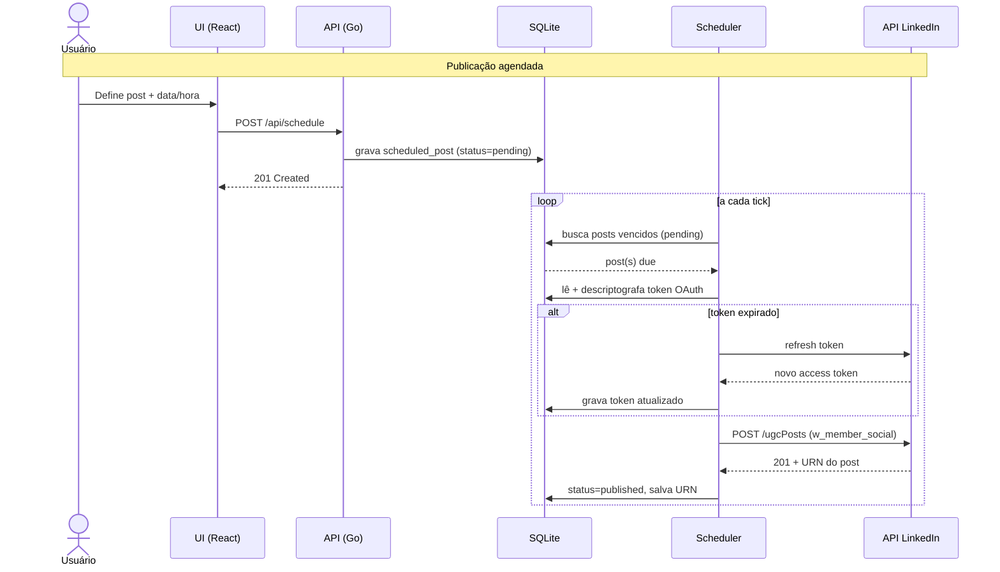
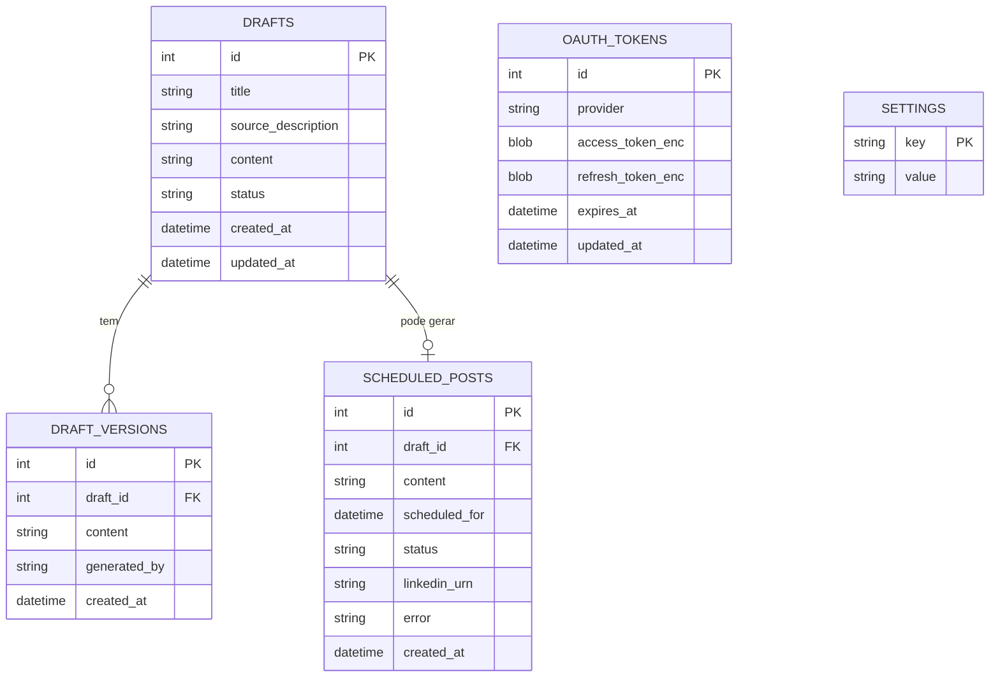

# LinkedIn Post Executor — Plano de Arquitetura

## Sumário executivo

O **LinkedIn Post Executor** é uma ferramenta **open source, local-first e de custo zero** que
ajuda um desenvolvedor a gerar, agendar e publicar conteúdo no **seu próprio** perfil do LinkedIn.
A arquitetura adotada é um **monólito modular** entregue como um **binário único em Go** com a
interface React/Vite embutida, persistência em **SQLite**, uma **camada de IA plugável**
(Ollama local por padrão, com opção de chave própria Claude/OpenAI) e publicação via **OAuth do
LinkedIn** no modelo _bring your own credentials_ (BYO).

> Veja os diagramas interativos em [`architecture-diagrams.html`](./architecture-diagrams.html)
> e as decisões em [`architecture/`](./architecture/).

## Resumo da descoberta (requisitos e restrições)

| Tema | Definição |
|---|---|
| **Problema** | Manter presença consistente no LinkedIn consome tempo; formatação e agendamento são fricções. |
| **Usuário** | O próprio desenvolvedor (single-user por instância). |
| **Modelo de produto** | Individualizado / self-hosted. "Vender" = cada pessoa roda a própria instância. |
| **Publicação** | Apenas no próprio perfil, via OAuth (`w_member_social`). Nunca para terceiros. |
| **Regras inegociáveis** | Open source (MIT) · local-first · custo zero · BYO credenciais · privacidade. |
| **Prioridades** | Qualidade e aprendizado acima de velocidade de entrega. Sem prazo. |

## Estilo de arquitetura

**Monólito modular** empacotado em um binário único.

| Estilo | Adequação | Veredito |
|---|---|---|
| **Monólito modular** | Single-user, local, simples; fronteiras de domínio claras (generate, drafts, schedule, linkedin). | ✅ **Escolhido** |
| Microserviços | Operação distribuída desnecessária para app local single-user. | ❌ Overkill |
| Serverless | Conflita com local-first e com o agendador persistente; depende de nuvem. | ❌ Não se aplica |

## Stack de tecnologia

| Camada | Primário | Alternativa | Racional |
|---|---|---|---|
| Backend | **Go** | Next.js full-stack | Binário único, distribuição trivial, goroutines para o scheduler. [ADR-001](./architecture/ADR-001-go-single-binary.md) |
| Frontend | **React + Vite** (embutido via `go:embed`) | HTMX/templ | UI rica, um único processo serve tudo. |
| Persistência | **SQLite** (`modernc.org/sqlite`) | arquivos JSON | Banco real, zero infra, binário sem CGO. [ADR-002](./architecture/ADR-002-sqlite-persistence.md) |
| IA | **Ollama (padrão) + BYO key** | só BYO key | Custo zero por padrão, flexível. [ADR-003](./architecture/ADR-003-pluggable-ai-ollama-default.md) |
| Publicação | **LinkedIn OAuth** (`w_member_social`) | — | BYO, sem aprovação de partner. [ADR-004](./architecture/ADR-004-byo-oauth-local-first.md) |
| Router HTTP | `chi` ou `net/http` (Go 1.22+) | — | Leve e idiomático. |
| CI | GitHub Actions (lint + test + build) | — | Qualidade e releases multiplataforma. |

## Arquitetura do sistema

### Contexto do sistema

### Componentes

### Fluxo de dados

```mermaid
flowchart LR
    A["Usuário informa<br/>título + descrição"] --> B["/api/generate"]
    B --> C{Provedor<br/>de IA}
    C -->|padrão| D["Ollama (local)"]
    C -->|BYO key| E["Claude / OpenAI"]
    D --> F["Post formatado<br/>(Unicode, hook, CTA, hashtags)"]
    E --> F
    F --> G["Usuário revisa/edita"]
    G --> H["Salva rascunho<br/>(SQLite)"]
    H --> I{Ação}
    I -->|Publicar agora| J["LinkedIn Client → API"]
    I -->|Agendar| K["scheduled_posts<br/>(SQLite)"]
    K --> L["Scheduler (goroutine)<br/>verifica horário"]
    L -->|chegou a hora| J
    J --> M(["Post publicado<br/>no LinkedIn ✅"])
```

### Deployment

### Sequência de publicação (agendada)

### Modelo de dados

## Roadmap de evolução

Como o app é single-user local, não há "escala de usuários" tradicional. A evolução é por
**capacidade**, em fatias verticais:

1. **Fundação** — scaffold Go + Vite + SQLite, CI/CD, estrutura modular.
2. **Fatia 1 — Gerar** — tema → IA (Ollama) → revisar/editar → salvar rascunho.
3. **Fatia 2 — Publicar** — OAuth do LinkedIn + publicação imediata.
4. **Fatia 3 — Agendar** — scheduler em segundo plano.
5. **Refino** — BYO key (Claude/OpenAI), métricas locais, melhorias de UX.
6. **Release** — binários multiplataforma + imagem Docker.

## Análise de custo

| Componente | Custo |
|---|---|
| Compute | R$ 0 — roda na máquina do usuário |
| Banco de dados | R$ 0 — SQLite em arquivo |
| IA (padrão) | R$ 0 — Ollama local |
| IA (opcional) | Pay-per-use da chave do próprio usuário (BYO) |
| Hospedagem | R$ 0 — não há servidor |

O custo permanece **zero** por design. O único gasto possível é, opcionalmente, o consumo da
chave de LLM que o próprio usuário decidir conectar.

## Boas práticas e padrões

- **Fronteiras de domínio** explícitas por módulo (generate / drafts / schedule / linkedin).
- **Interface `AIProvider`** isolando o domínio de provedores externos (princípio de inversão de dependência).
- **TypeScript strict** no frontend; lint + format (Go: `golangci-lint`, `gofmt`).
- **Pirâmide de testes:** unit (formatação Unicode, agendamento), integração (repositório SQLite), e2e do fluxo gerar→publicar. Foco na lógica de negócio, sem dogma de cobertura.
- **ADRs** para decisões relevantes (este diretório).
- **Conventional Commits**, branches curtas, PRs revisados.

### Anti-padrões a evitar

- Otimização prematura (ex.: escolher tech por "performance" de CPU quando a latência é do LLM).
- Acoplar a lógica de geração a um provedor de IA específico.
- Guardar segredos/tokens em texto puro.

## Arquitetura de segurança

- **Segredos** (chaves de IA, client secret do LinkedIn) nunca no código — via `.env`/settings.
- **Tokens OAuth criptografados em repouso** no SQLite; refresh automático antes da expiração (~60 dias).
- Superfície mínima: API exposta apenas em `localhost`.
- Sem telemetria nem terceiros intermediando dados.

## Riscos e mitigações

| Risco | Impacto | Mitigação |
|---|---|---|
| Mudanças/limites da API do LinkedIn | Alto | Isolar em `LinkedIn Client`; tratar erros e rate limits; documentar versão da API. |
| Expiração de token quebrar agendamentos | Médio | Refresh automático + reautenticação guiada na UI. |
| Qualidade variável do Ollama local | Médio | Permitir BYO key; oferecer prompts/modelos recomendados. |
| Onboarding do app no LinkedIn ser confuso | Médio | Documentação passo a passo com prints. |
| Perda do arquivo `data.db` | Baixo | Orientar backup; arquivo único é fácil de copiar. |

## Decisões registradas (ADRs)

- [ADR-001 — Backend em Go, binário único](./architecture/ADR-001-go-single-binary.md)
- [ADR-002 — Persistência com SQLite](./architecture/ADR-002-sqlite-persistence.md)
- [ADR-003 — IA plugável, Ollama por padrão](./architecture/ADR-003-pluggable-ai-ollama-default.md)
- [ADR-004 — Publicação BYO via OAuth local-first](./architecture/ADR-004-byo-oauth-local-first.md)

## Próximos passos

1. Scaffold do repositório (estrutura Go modular + Vite + SQLite + CI + licença MIT).
2. Implementar a **Fatia 1 (Gerar)** com o `OllamaProvider` e o prompt do `linkedin-post-writer`.
3. Implementar OAuth + publicação (Fatia 2) e, em seguida, o scheduler (Fatia 3).
