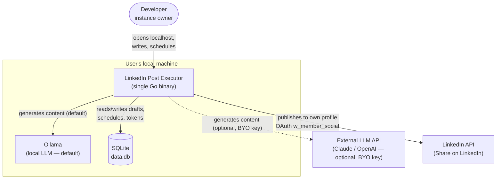
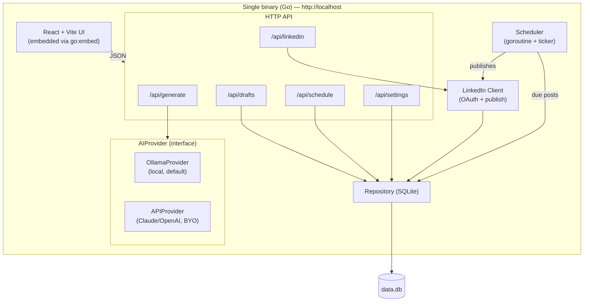
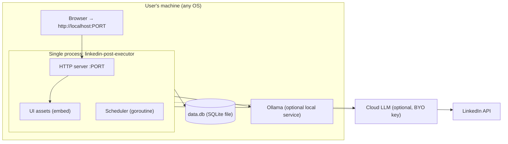
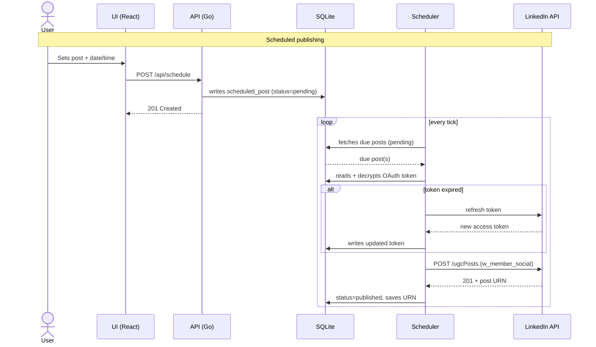
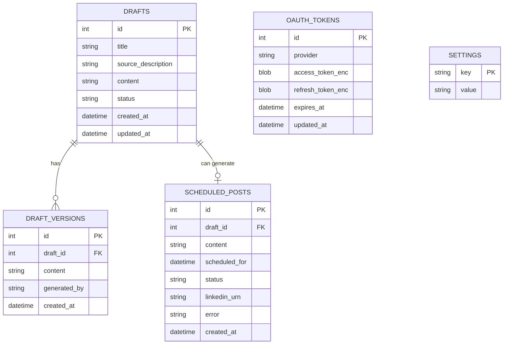

# LinkedIn Post Executor — Architecture Plan

## Executive summary

The **LinkedIn Post Executor** is an **open source, local-first, zero-cost** tool that
helps a developer generate, schedule, and publish content to **their own** LinkedIn profile.
The chosen architecture is a **modular monolith** delivered as a **single Go binary** with the
React/Vite interface embedded, **SQLite** persistence, a **pluggable AI layer**
(local Ollama by default, with the option of your own Claude/OpenAI key), and publishing via
**LinkedIn OAuth** in the _bring your own credentials_ (BYO) model.

> See the interactive diagrams in [`architecture-diagrams.html`](./architecture-diagrams.html)
> and the decisions in [`architecture/`](./architecture/).

## Discovery summary (requirements and constraints)

| Topic | Definition |
|---|---|
| **Problem** | Maintaining a consistent LinkedIn presence is time-consuming; formatting and scheduling are friction points. |
| **User** | The developer themselves (single-user per instance). |
| **Product model** | Individualized / self-hosted. "Selling" = each person runs their own instance. |
| **Publishing** | Only to one's own profile, via OAuth (`w_member_social`). Never on behalf of others. |
| **Non-negotiable rules** | Open source (MIT) · local-first · zero cost · BYO credentials · privacy. |
| **Priorities** | Quality and learning over delivery speed. No deadline. |

## Architecture style

A **modular monolith** packaged into a single binary.

| Style | Fit | Verdict |
|---|---|---|
| **Modular monolith** | Single-user, local, simple; clear domain boundaries (generate, drafts, schedule, linkedin). | ✅ **Chosen** |
| Microservices | Distributed operation is unnecessary for a single-user local app. | ❌ Overkill |
| Serverless | Conflicts with local-first and with the persistent scheduler; depends on the cloud. | ❌ Not applicable |

## Technology stack

| Layer | Primary | Alternative | Rationale |
|---|---|---|---|
| Backend | **Go** | Next.js full-stack | Single binary, trivial distribution, goroutines for the scheduler. [ADR-001](./architecture/ADR-001-go-single-binary.md) |
| Frontend | **React + Vite** (embedded via `go:embed`) | HTMX/templ | Rich UI, a single process serves everything. |
| Persistence | **SQLite** (`modernc.org/sqlite`) | JSON files | A real database, zero infra, CGO-free binary. [ADR-002](./architecture/ADR-002-sqlite-persistence.md) |
| AI | **Ollama (default) + BYO key** | BYO key only | Zero cost by default, flexible. [ADR-003](./architecture/ADR-003-pluggable-ai-ollama-default.md) |
| Publishing | **LinkedIn OAuth** (`w_member_social`) | — | BYO, no partner approval. [ADR-004](./architecture/ADR-004-byo-oauth-local-first.md) |
| HTTP router | `chi` or `net/http` (Go 1.22+) | — | Lightweight and idiomatic. |
| CI | GitHub Actions (lint + test + build) | — | Quality and cross-platform releases. |

## System architecture

### System context

### Components

### Data flow

```mermaid
flowchart LR
    A["User provides<br/>title + description"] --> B["/api/generate"]
    B --> C{AI<br/>provider}
    C -->|default| D["Ollama (local)"]
    C -->|BYO key| E["Claude / OpenAI"]
    D --> F["Formatted post<br/>(Unicode, hook, CTA, hashtags)"]
    E --> F
    F --> G["User reviews/edits"]
    G --> H["Saves draft<br/>(SQLite)"]
    H --> I{Action}
    I -->|Publish now| J["LinkedIn Client → API"]
    I -->|Schedule| K["scheduled_posts<br/>(SQLite)"]
    K --> L["Scheduler (goroutine)<br/>checks time"]
    L -->|time has come| J
    J --> M(["Post published<br/>on LinkedIn ✅"])
```

### Deployment

### Publishing sequence (scheduled)

### Data model

## Evolution roadmap

Since the app is single-user and local, there is no traditional "user scaling." Evolution happens
by **capability**, in vertical slices:

1. **Foundation** — Go + Vite + SQLite scaffold, CI/CD, modular structure.
2. **Slice 1 — Generate** — topic → AI (Ollama) → review/edit → save draft.
3. **Slice 2 — Publish** — LinkedIn OAuth + immediate publishing.
4. **Slice 3 — Schedule** — background scheduler.
5. **Refinement** — BYO key (Claude/OpenAI), local metrics, UX improvements.
6. **Release** — cross-platform binaries + Docker image.

## Cost analysis

| Component | Cost |
|---|---|
| Compute | $0 — runs on the user's machine |
| Database | $0 — file-based SQLite |
| AI (default) | $0 — local Ollama |
| AI (optional) | Pay-per-use on the user's own key (BYO) |
| Hosting | $0 — there is no server |

The cost remains **zero** by design. The only possible expense is, optionally, the usage of the
LLM key that the user themselves chooses to connect.

## Best practices and patterns

- Explicit **domain boundaries** per module (generate / drafts / schedule / linkedin).
- An **`AIProvider` interface** isolating the domain from external providers (dependency inversion principle).
- **Strict TypeScript** on the frontend; lint + format (Go: `golangci-lint`, `gofmt`).
- **Test pyramid:** unit (Unicode formatting, scheduling), integration (SQLite repository), and e2e for the generate→publish flow. Focus on business logic, with no coverage dogma.
- **ADRs** for relevant decisions (this directory).
- **Conventional Commits**, short branches, reviewed PRs.

### Anti-patterns to avoid

- Premature optimization (e.g., choosing tech for CPU "performance" when latency comes from the LLM).
- Coupling the generation logic to a specific AI provider.
- Storing secrets/tokens in plain text.

## Security architecture

- **Secrets** (AI keys, LinkedIn client secret) never in code — via `.env`/settings.
- **OAuth tokens encrypted at rest** in SQLite; automatic refresh before expiration (~60 days).
- Minimal surface: the API is exposed only on `localhost`.
- No telemetry and no third parties intermediating data.

## Risks and mitigations

| Risk | Impact | Mitigation |
|---|---|---|
| LinkedIn API changes/limits | High | Isolate in the `LinkedIn Client`; handle errors and rate limits; document the API version. |
| Token expiration breaking schedules | Medium | Automatic refresh + guided re-authentication in the UI. |
| Variable quality of local Ollama | Medium | Allow BYO key; offer recommended prompts/models. |
| Confusing LinkedIn app onboarding | Medium | Step-by-step documentation with screenshots. |
| Loss of the `data.db` file | Low | Advise backups; a single file is easy to copy. |

## Recorded decisions (ADRs)

- [ADR-001 — Go backend, single binary](./architecture/ADR-001-go-single-binary.md)
- [ADR-002 — Persistence with SQLite](./architecture/ADR-002-sqlite-persistence.md)
- [ADR-003 — Pluggable AI, Ollama by default](./architecture/ADR-003-pluggable-ai-ollama-default.md)
- [ADR-004 — BYO publishing via local-first OAuth](./architecture/ADR-004-byo-oauth-local-first.md)

## Next steps

1. Scaffold the repository (modular Go structure + Vite + SQLite + CI + MIT license).
2. Implement **Slice 1 (Generate)** with the `OllamaProvider` and the `linkedin-post-writer` prompt.
3. Implement OAuth + publishing (Slice 2), and then the scheduler (Slice 3).
